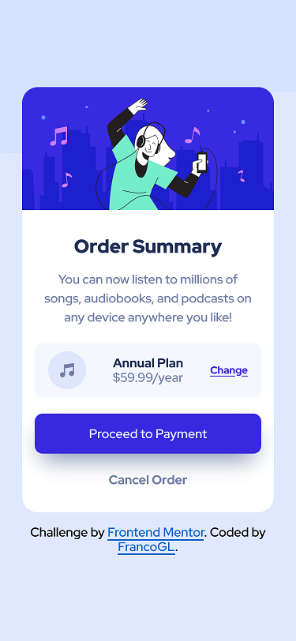

# Frontend Mentor - Order summary card solution

This is a solution to the [Order summary card challenge on Frontend Mentor](https://www.frontendmentor.io/challenges/order-summary-component-QlPmajDUj). Frontend Mentor challenges help you improve your coding skills by building realistic projects. 

## The challenge

- Build out the project to the designs provided

## Screenshot
### Mobile

### Desktop

### Links

- Solution URL: [Frontend Mentor](https://www.frontendmentor.io/solutions/profile-card-component-with-css-W5_eoiHDt)
- Live Site URL: [Live Site with Vercel](https://profile-card-component-main-blond-chi.vercel.app/)

## Built with

- Semantic HTML5 markup
- SASS
- CSS custom properties
- Flexbox
- Mobile-first workflow

## Author

- Frontend Mentor - [@FrancoGL](https://www.frontendmentor.io/profile/FrancoGL)
